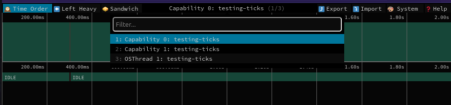
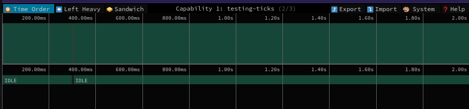
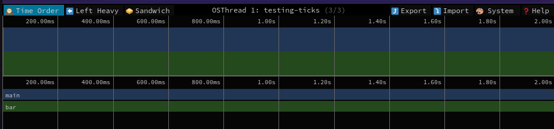
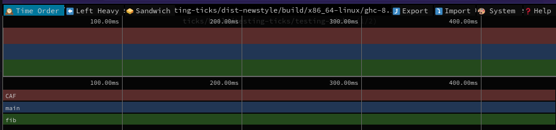
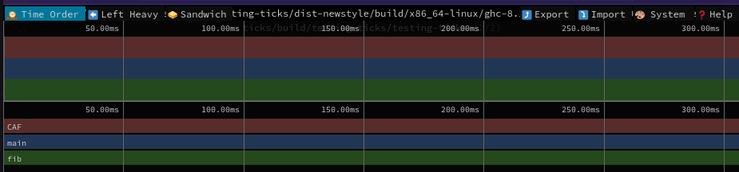
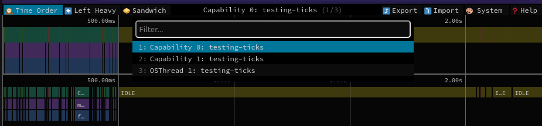
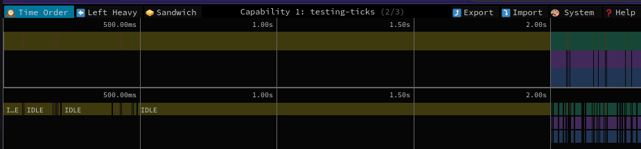
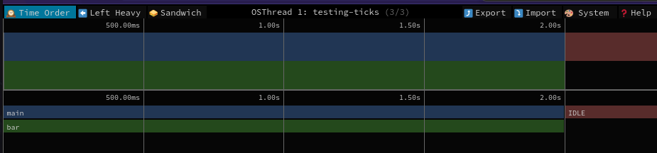

# `hs-safescope`

> :warning: This project is still a mere prototype!!

`hs-safescope` is a tool that extends the approach taken by
[`hs-speedscope`](https://github.com/mpickering/hs-speedscope) and
[`ghc-events-analyze`](https://github.com/well-typed/ghc-events-analyze) to add
foreign calls into the flamegraph representation making use of eventlog.

Table of Contents
=================

* [Usage](#usage)
* [Limitations](#limitations)
* [Features](#features)
* [Background: FFI and time profiling in GHC](#background-ffi-and-time-profiling-in-ghc)
   * [A brief look at the runtime system](#a-brief-look-at-the-runtime-system)
   * [Time profiling](#time-profiling)
   * [FFI](#ffi)
   * [FFI and ticks](#ffi-and-ticks)
* [Emitting events to track time spent in foreign calls](#emitting-events-to-track-time-spent-in-foreign-calls)
   * [Start and stop markers](#start-and-stop-markers)
   * [Cost-centre stacks](#cost-centre-stacks)
   * [Thread information](#thread-information)
   * [Thread information improved version](#thread-information-improved-version)
   * [GCC further instrumentation](#gcc-further-instrumentation)
* [Full example](#full-example)
* [A bit more interesting full example](#a-bit-more-interesting-full-example)
      
## Usage

In order to use this tool, one has to annotate the code with events as described
in [Emitting events to track time spent in foreign
calls](#emitting-events-to-track-time-spent-in-foreign-calls), link with the
eventlog RTS flavor and then run the program with the following RTS arguments:

``` bash
cabal run <exe> -- <args> +RTS -l-au -p -N<caps> -RTS
```

Then running `hs-safescope` on the generated `.eventlog` file, it will generate
a json file suitable to be imported into
[`speedscope`](https://speedscope.app/).

``` bash
hs-safescope <path/to/.eventlog/file>
```

## Limitations

The code is still only suitable for a prototype.

The process for annotating the code is boring and feels boilerplate-ish. This can
be almost surely automated by Template Haskell, but I still am not very
knowledgeable in TH.

## Features

- [x] Show IDLE time.
- [x] Graph Haskell's CCS at entry points to the C code.
- [x] Separate graphs by capabilities *and* by OS threads.
- [ ] TH to generate annotations in a comfortable way.

## Background: FFI and time profiling in GHC

### A brief look at the runtime system

GHC's runtime system creates _Haskell threads_ (green threads) which are
lightweight virtual threads that the scheduler will wake up and deschedule. A
Haskell program running on one OS thread can have multiple Haskell threads being
executed on that same OS thread at different intervals.

GHC's multithreaded runtime system makes use of _capabilities_ which are
essentially global locks that a Haskell thread must acquire before being able to
run. The concurrency implemented in GHC is based on cooperative yielding, so
tasks yield a capability from time to time so that the RTS is able to give that
capability to a different task.

Each capability has a pool of worker OS threads that can be used by the
capability to run the given task.

### Time profiling

When the RTS is instructed to do time profiling by both compiling with `-prof`
and being given `-p` as a RTS argument to the executable, it runs a ticker that
on each tick will traverse the capabilities incrementing the number of ticks on
the current cost center stack of the task that is holding the capability
([see](https://gitlab.haskell.org/ghc/ghc/-/blob/master/rts/Proftimer.c#L114)).

The result of these ticks is processed into a time report when the program
finishes and if the eventlog tracing is enabled (using `-eventlog` when linking
and `-l` when running) then `ProfSampleCostCentre` events are emitted to the
eventlog.

The total running time reported at the end of the run is calculated by roughly
the [following
formula](https://gitlab.haskell.org/ghc/ghc/-/blob/16b9100c9ef6b34b88a52b3b9e663dd40abd028f/rts/ProfilerReport.c#L297-302):

```
total_ticks * tick_interval / num_capabilities
```


### FFI

GHC's implementation of the FFI described in the report results in three types
of FFI import declarations:

- `safe`: foreign code that is allowed to call back into Haskell code. Higher overhead.
- `interruptible`: same as `safe` but also installs a signal handler that kills
  the thread upon receiving a `throwTo` exception.
- `unsafe`: foreign code that is not allowed to call back into Haskell code. Smaller overhead.

Imagine the following Haskell code:

``` haskell
foreign import ccall unsafe        "foo" foo :: IO ()
foreign import ccall safe          "bar" bar :: IO ()
foreign import ccall interruptible "ber" ber :: IO ()

baz = do
  foo
  bar
  ber
```

This will result in the following `C--` code (using `-ddump-cmm`):

``` c
...
           call "ccall" arg hints:  []  result hints:  [] foo();
...
           (_u3jD::I64) = call "ccall" arg hints:  [PtrHint,]  result hints:  [PtrHint] suspendThread(BaseReg, 0);
           call "ccall" arg hints:  []  result hints:  [] bar();
           (_u3jE::I64) = call "ccall" arg hints:  [PtrHint]  result hints:  [PtrHint] resumeThread(_u3jD::I64);
...
           (_u3jD::I64) = call "ccall" arg hints:  [PtrHint,]  result hints:  [PtrHint] suspendThread(BaseReg, 1);
           call "ccall" arg hints:  []  result hints:  [] ber();
           (_u3jE::I64) = call "ccall" arg hints:  [PtrHint]  result hints:  [PtrHint] resumeThread(_u3jD::I64);
...
```

Here we can see that the capability is released by the call to `suspendThread`
and requested again when the foreign code returns with `resumeThread`. However,
the call is not spawned in a different OS thread, it just continues running. In
some sense, it "steals" the thread from the Haskell RTS until it returns.

When the capability is released by calling `suspendThread`, the RTS will spawn
new worker threads if none are available to continue running Haskell code
([see](https://gitlab.haskell.org/ghc/ghc/-/blob/master/rts/Capability.c#L580)).

### FFI and ticks

When a call to foreign code is performed and the thread is stolen from the RTS,
a tick will not see the foreign code being executed, as it just asks the
capabilities which cost centre they are currently executing. This makes us lose
track of how much time is being spent in the foreign call. In particular, the
example above will only report the time for the `unsafe` call as the capability
is still held by the task, and the rest of the time will be as if it didn't
exist for Haskell.

## Emitting events to track time spent in foreign calls

The approach followed by this tool is using eventlog profiling in the same style
`ghc-events-anlyze` does to annotate the time spent in the foreign calls. For
this goal, we annotate foreign C calls with some events. We will show
incrementally what each event that we add will provide. 

### Start and stop markers

First we surround the events with `START` and `STOP` events exactly as done in
`ghc-events-analyze`. To also be able to differentiate different calls to the
same function, we spawn a global `IORef` that acts as a counter.

``` haskell
foreign import ccall safe "bar_c" bar_c :: IO ()

{-# NOINLINE bar_cnt #-}
bar_cnt :: IORef Int
bar_cnt = unsafePerformIO $ newIORef 0

bar :: IO ()
bar = do
  c <- atomicModifyIORef' bar_cnt (\c -> (c + 1, c))
  traceEventIO $ "START " <> c <> " bar"
  bar_c
  traceEventIO $ "END " <> c <> " bar"
```

Now, by looking at the events one can tell when the foreign code was being
executed. This of course depends on the RTS scheduling, but should be accurate
enough.

### Cost-centre stacks

We are missing all the context on how we got to this function. In order to solve
this, we can create a new event that will explicitly carry the cost-centre stack:

``` diff 
foreign import ccall safe "bar_c" bar_c :: IO ()

{-# NOINLINE bar_cnt #-}
bar_cnt :: IORef Int
bar_cnt = unsafePerformIO $ newIORef 0

bar :: IO ()
bar = do
  c <- atomicModifyIORef' bar_cnt (\c -> (c + 1, c))
  traceEventIO $ "START " <> c <> " bar"
+ traceEventIO . (<>) ("ANN_CCS " <> c <> " bar ") . show =<< ccsToStrings =<< getCurrentCCS undefined
  bar_c
  traceEventIO $ "END " <> c <> " bar"
```

This event will carry the Haskell CCS that should allow to build the call stack
up to this point and add this event into the flamegraph.

### Thread information

It is difficult to decide where these events are to be shown:

- In the same flamegraph as the capability: no, because once the thread enters
  the foreign code, the capability will resume other tasks and we would get a
  corrupted (or overlapping) graph.
- In a graph representing "the foreign calls made by capability X": no, because
  once the capability continues executing Haskell code it can spawn another
  foreign call before the previous one was finished therefore having the same
  problem as the graph above.
- In a per-OS-thread graph: seems plausible. Also if the RTS reuses the thread
  once the foreign call is done, we would get both foreign calls in the same
  graph.
  
To implement the third option, we have to know the thread ID in which the
foreign code is running, and this is a non-trivial task that seems to be
non-portable. For now I'm targeting usual Linux OSes so I assume that `gettid`
exists.

We could call `gettid` from within Haskell code, but this doesn't ensure that
the thread that would emit the event is the same thread that will run the
foreign call, so the only way to circumvent this is by using the Eventlog API
directly from within the foreign code. 

In particular, if we want to finally call the foreign function `bar_c`, we are now
going to create a wrapper over it emitting the event to the eventlog (we will do
it in a much more comfortable way later on):

``` diff
-foreign import ccall safe "bar_c" bar_c :: IO ()
+foreign import ccall safe "bar_wrapper" bar_wrapper :: C.CInt -> IO ()


{-# NOINLINE bar_cnt #-}
-bar_cnt :: IORef Int
+bar_cnt :: IORef C.CInt
bar_cnt = unsafePerformIO $ newIORef 0

bar :: IO ()
bar = do
  c <- atomicModifyIORef' bar_cnt (\c -> (c + 1, c))
  traceEventIO $ "START " <> c <> " bar"
  traceEventIO . (<>) ("ANN_CCS " <> c <> " bar ") . show =<< ccsToStrings =<< getCurrentCCS undefined
- bar_c
+ bar_wrapper c
  traceEventIO $ "END " <> c <> " bar"
```

Where `bar_wrapper` will be defined as:

``` c
#define _GNU_SOURCE
include "<stdlib.h>"
include "<unistd.h>"
include "Rts.h"
include "Trace.h"
include "Capability.h"

void bar_c() {
    ...
}

void bar_wrapper(int counter) {
    pid_t tid = gettid();
    ssize_t bufsz = snprintf(NULL, 0, "ANN_TH %d %s %d", counter, "bar", tid);
    char* buf = malloc(bufsz + 1);
    snprintf(buf, bufsz + 1, "ANN_TH %d %s %d", counter, "bar", tid);

    // there is no Haskell capability running this, so just assign it to the MainCapability
    traceUserMsg(&MainCapability, buf);

    free(buf);
    bar_c();
}
```

Now we are going to get an event that will tell us the OS thread ID for the call
to `bar` indexed by the counter that we provide. Note that we need to include
some RTS headers to bring into scope the definitions for the functions and types
used in the wrapper.

### Thread information improved version

Making use of [`inline-c`](https://github.com/fpco/inline-c), we can omit the
manual definition of the wrapper by using Template Haskell. We could leave the C
code as is and write the following Haskell code (`mylib` has to be replaced with
a header that describes the foreign functions we want to use, in this case
`bar_c`):

``` diff
-foreign import ccall safe "bar_c" bar_c :: IO ()

+C.verbatim "#define _GNU_SOURCE"
+C.include "<stdlib.h>"
+C.include "<unistd.h>"
+C.include "Rts.h"
+C.include "Trace.h"
+C.include "Capability.h"
+C.include "<mylib>.h"

{-# NOINLINE bar_cnt #-}
bar_cnt :: IORef C.CInt
bar_cnt = unsafePerformIO $ newIORef 0

bar :: IO ()
bar = do
  c <- atomicModifyIORef' bar_cnt (\c -> (c + 1, c))
  traceEventIO $ "START " <> c <> " bar"
  traceEventIO . (<>) ("ANN_CCS " <> c <> " bar ") . show =<< ccsToStrings =<< getCurrentCCS undefined
- bar_c
+ [C.block| void {
+
+           pid_t tid = gettid();
+           int counter = $(int c);
+           ssize_t bufsz = snprintf(NULL, 0, "ANN_TH %d %s %d", counter, "bar", tid);
+           char* buf = malloc(bufsz + 1);
+           snprintf(buf, bufsz + 1, "ANN_TH %d %s %d", counter, "bar", tid);
+
+           // there is no Haskell capability running this, so just assign it to the MainCapability
+           traceUserMsg(&MainCapability, buf);
+
+           free(buf);
+
+           bar_c();
+           } |]
  traceEventIO $ "END " <> c <> " bar"
```

This will produce a C file that will be linked to our program defining the
wrapper function for us. Reading the `inline-c` documentation, one can learn how
to provide even callback functions to be passed to the C code with anti-quoters.

Future work should wrap all this in a Template Haskell expression.

### GCC further instrumentation

`gcc` has a profiling option for inserting a call to a profiling function on
every function entry and exit. This can be combined in a way similar to the
above to produce even more events that would allow for drawing a flamegraph even
inside the foreign code.

To do this, we have to define a couple of functions in the C code, basically
doing something similar to the inline C code above:

``` c
#define _GNU_SOURCE
#include <stdlib.h>
#include <unistd.h>
#include <stdio.h>
#include "Rts.h"
#include "Trace.h"
#include "Capability.h"

void __cyg_profile_func_enter(void *this_fn, void *call_site) __attribute__((no_instrument_function));
void __cyg_profile_func_exit(void *this_fn, void *call_site)  __attribute__((no_instrument_function));

void bar() {
    ...
}

void __cyg_profile_func_enter ( void *this_fn, void *call_site ) {
  pid_t tid = gettid();
  ssize_t bufsz = snprintf(NULL, 0, "ANN_CALL_TO %p %p %d", this_fn, call_site, tid);
  char* buf = malloc(bufsz + 1);
  snprintf(buf, bufsz + 1, "ANN_CALL_TO %p %p %d", this_fn, call_site, tid);

  // there is no Haskell capability running this, so just assign it to the MainCapability
  traceUserMsg(&MainCapability, buf);

  free(buf);
}

void __cyg_profile_func_exit ( void *this_fn, void *call_site ) {
  pid_t tid = gettid();
  ssize_t bufsz = snprintf(NULL, 0, "ANN_CALL_RET %p %p %d", this_fn, call_site, tid);
  char* buf = malloc(bufsz + 1);
  snprintf(buf, bufsz + 1, "ANN_CALL_RET %p %p %d", this_fn, call_site, tid);

  // there is no Haskell capability running this, so just assign it to the MainCapability
  traceUserMsg(&MainCapability, buf);

  free(buf);
}
```

Compiling then with `-finstrument-functions` will result in these events being
emitted to the eventlog.

## Full example

For this example we are going use the following C code. It defines a function `bar` which basically prints the provided value and sleeps for 2 seconds:

``` c
// bar.c

#define _GNU_SOURCE
#include <stdlib.h>
#include <unistd.h>
#include <stdio.h>
#include "Rts.h"
#include "Trace.h"
#include "Capability.h"

void __cyg_profile_func_enter(void *this_fn, void *call_site) __attribute__((no_instrument_function));
void __cyg_profile_func_exit(void *this_fn, void *call_site)  __attribute__((no_instrument_function));

void bar_c(int num) {
  printf("Received %d\n", num);
  sleep(2);
}

void __cyg_profile_func_enter ( void *this_fn, void *call_site ) {
  pid_t tid = gettid();
  ssize_t bufsz = snprintf(NULL, 0, "ANN_CALL_TO %p %p %d", this_fn, call_site, tid);
  char* buf = malloc(bufsz + 1);
  snprintf(buf, bufsz + 1, "ANN_CALL_TO %p %p %d", this_fn, call_site, tid);

  // there is no Haskell capability running this, so just assign it to the MainCapability
  traceUserMsg(&MainCapability, buf);

  free(buf);
}

void __cyg_profile_func_exit ( void *this_fn, void *call_site ) {
  pid_t tid = gettid();
  ssize_t bufsz = snprintf(NULL, 0, "ANN_CALL_RET %p %p %d", this_fn, call_site, tid);
  char* buf = malloc(bufsz + 1);
  snprintf(buf, bufsz + 1, "ANN_CALL_RET %p %p %d", this_fn, call_site, tid);

  // there is no Haskell capability running this, so just assign it to the MainCapability
  traceUserMsg(&MainCapability, buf);

  free(buf);
}
```

The C code is compiled using:

``` bash
❯ gcc 
    -finstrument-functions 
    -I/home/javier/.ghcup/ghc/8.10.7/lib/ghc-8.10.7/include
    -I/home/javier/ghc/rts/ 
    -c 
    -O 
    -o out.o 
    bar.c
bar.c: In function ‘__cyg_profile_func_enter’:
bar.c:24:3: warning: implicit declaration of function ‘traceUserMsg’; did you mean ‘dtraceUserMsg’? [-Wimplicit-function-declaration]
   24 |   traceUserMsg(&MainCapability, buf);
      |   ^~~~~~~~~~~~
      |   dtraceUserMsg
❯ ar rcs libCbar.a out.o
```

We need `-I/home/javier/ghc/rts` because the GHC installed with `ghcup` for some reason is missing `Trace.h`. We need `-I/home/javier/.ghcup/ghc/8.10.7/lib/ghc-8.10.7/include` because the source of GHC is missing `ghcautoconf.h` and `Rts.h` is missing that one. I'm not sure why the `traceUserMsg` function is said to not be defined as it is declared in `Trace.h` which we are including.

We then have the Haskell code as follows:

``` haskell
-- app/Main.hs

{-# LANGUAGE TemplateHaskell #-}
{-# LANGUAGE QuasiQuotes     #-}

module Main where

import           Data.IORef
import           Debug.Trace ( traceEventIO )
import qualified Foreign.C as C (CInt(..))
import           GHC.Stack ( ccsToStrings, getCurrentCCS )
import qualified Language.C.Inline as C ( block, include, verbatim )
import           System.IO.Unsafe ( unsafePerformIO )

C.verbatim "#define _GNU_SOURCE"
C.include "<stdlib.h>"
C.include "<unistd.h>"
C.include "Rts.h"
C.include "Trace.h"
C.include "Capability.h"
C.include "bar.h"

{-# NOINLINE bar_cnt #-}
bar_cnt :: IORef C.CInt
bar_cnt = unsafePerformIO $ newIORef 0

bar :: C.CInt -> IO ()
bar a1 = do
  c <- atomicModifyIORef' bar_cnt (\c -> return (c + 1, c))
  traceEventIO $ "START " <> show c <> " bar"
  traceEventIO . (<>) ("ANN_SCC " <> show c <> " bar ") . show =<< ccsToStrings =<< getCurrentCCS undefined
  [C.block| void {

          pid_t tid = gettid();
          int counter = $(int c);
          ssize_t bufsz = snprintf(NULL, 0, "ANN_TH %d %s %d", counter, "bar", tid);
          char* buf = malloc(bufsz + 1);
          snprintf(buf, bufsz + 1, "ANN_TH %d %s %d", counter, "bar", tid);

          // there is no Haskell capability running this, so just assign it to the MainCapability
          traceUserMsg(&MainCapability, buf);

          free(buf);

          bar_c($(int a1));
          } |]
  traceEventIO $ "STOP " <> show c <> " bar"
  
main :: IO ()
main = do
  bar 10
```

With the following cabal files:

``` cabal-config
-- cabal.project
packages: .

extra-include-dirs: /home/javier/example -- the directory where the libCbar.a library is located
                    /home/javier/ghc/rts
```

``` cabal-config
-- cabal.project.local
profiling: True
```

``` cabal-config
-- example.cabal
...
executable example
    main-is:          Main.hs
    build-depends:    base,
                      inline-c
    hs-source-dirs:   app
    default-language: Haskell2010
    extra-libraries:  Cbar
    ghc-options:      -threaded
                      -eventlog
                      -rtsopts
                      -fno-prof-count-entries
    extra-lib-dirs:   /home/javier/example
```

We can now run the program with:

``` bash
❯ /usr/bin/time cabal run exe:example -- +RTS -l-au -p -N2 -RTS
...
Received 10
0.07user 0.06system 0:02.07elapsed
```

We can now inspect the `example.prof` file:

``` 
❯ cat example.prof
	Sun May 15 17:35 2022 Time and Allocation Profiling Report  (Final)

	   example +RTS -l-au -p -N2 -RTS

	total time  =        0.00 secs   (0 ticks @ 1000 us, 2 processors)
	total alloc =     102,792 bytes  (excludes profiling overheads)

COST CENTRE MODULE           SRC                         %time %alloc

MAIN        MAIN             <built-in>                    0.0   37.3
CAF         GHC.Event.Thread <entire-module>               0.0    1.2
CAF         GHC.IO.Handle.FD <entire-module>               0.0   33.8
CAF         GHC.IO.Encoding  <entire-module>               0.0    2.6
bar         Main             app/Main.hs:(26,1)-(45,44)    0.0   23.6
```

As expected, the Haskell profiling report shows a running time of 0, whereas the
program took 2 seconds to run.

If we now run hs-speedscope on the eventlog report, an empty graph on speedscope
(as no ticks were recorded at all!).

If we run `hs-safescope` on the eventlog, we get the following graphs, one for each capability and one for the released OS thread running foreign code:







The small non-idle time is a `GC` call. A look at the User events emitted in the
eventlog shows the following messages:

``` 
ghci> el <- either error (events . dat) <$> readEventLogFromFile "/home/javier/example/example.eventlog"
ghci> sortOn evTime $ filter (\x -> case evSpec x of UserMessage {} -> True; _ -> False) el
[ Event
    { evTime = 667764
    , evSpec = UserMessage
        { msg = "START 0 bar" }
    , evCap = Just 1
    }
, Event
    { evTime = 688034
    , evSpec = UserMessage
        { msg = "ANN_SCC 0 bar ["Main.main (app/Main.hs:(48,1)-(49,8))","Main.bar (app/Main.hs:(26,1)-(45,44))"]" }
    , evCap = Just 1
    }
, Event
    { evTime = 693717
    , evSpec = UserMessage
        { msg = "ANN_TH 0 bar 14181" }
    , evCap = Just 0
    }
, Event
    { evTime = 694762
    , evSpec = UserMessage
        { msg = "ANN_CALL_TO 0x410061 0x40ff00 14181" }
    , evCap = Just 0
    }
, Event
    { evTime = 2000837436
    , evSpec = UserMessage
        { msg = "ANN_CALL_RET 0x410061 0x40ff00 14181" }
    , evCap = Just 0
    }
, Event
    { evTime = 2000879200
    , evSpec = UserMessage
        { msg = "STOP 0 bar" }
    , evCap = Just 1
    }
]
```

The `ANN_CALL_XX` events have to be interpreted in the light of the symbols in the executable itself:

``` bash
❯ addr2line -f -e dist-newstyle/build/x86_64-linux/ghc-8.10.7/example-0.1.0.0/x/example/build/example/example 0x410061
bar_c
??:?
❯ nm examples/example/dist-newstyle/build/x86_64-linux/ghc-8.10.7/example-0.1.0.0/x/example/build/example/example | grep 410061
0000000000410061 T bar_c
```

In this case it is not particularly useful because this call emitted is actually
the Haskell call to C code, but in principle this could be used to build CCSs
inside the C code that could be prepended by the Haskell CCS at call site to
place the C flamegraph on top of Haskell's flamegraph.

## A bit more interesting full example

Taking the `main` above and adding a secondary Haskell task to run, we get a more interesting example:

``` haskell
{-# LANGUAGE TemplateHaskell #-}
{-# LANGUAGE QuasiQuotes     #-}

module Main where

...

fib 1 = 1
fib 2 = 1
fib n = fib (n - 1) + fib (n - 2)

main :: IO ()
main = do
  forkIO $ print $ fib 35
  bar 10
  print $ fib 34
```

We can then run the executable:

``` bash
❯ /usr/bin/time cabal run exe:example -- +RTS -l-au -p -N2 -RTS
...
Received 10
9227465
5702887
0.98user 0.03system 0:02.41elapsed
```

Inspecting the Haskell time report, we see that only the time for `fib` was accounted:

``` 
❯ cat example.prof
	Sun May 15 18:05 2022 Time and Allocation Profiling Report  (Final)

	   example +RTS -l-au -p -N2 -RTS

	total time  =        0.39 secs   (771 ticks @ 1000 us, 2 processors)
	total alloc = 716,772,912 bytes  (excludes profiling overheads)

COST CENTRE MODULE SRC                         %time %alloc

fib         Main   app/Main.hs:(21,1)-(23,33)   99.9  100.0
```

Now inspecting this with `hs-speedscope`, we see the following graphs:





Which show graphs with two different time scales and it is very difficult to understand what happened in this program. On the other hand, if we run `hs-safescope` we get the following graphs:



Here we can see that the capability 0 runs a first call to `fib` (one can zoom into the graph to see the actual names) which belongs to the `forkIO`'ed call, and then remains IDLE until the end (participating in some garbage collections later).



We see now that capability 1 runs a call to `fib` at the end, which belongs to the `fib` call after the call to `bar`.



Here we see a call to `bar` that runs for 2 seconds and then switches back to a Haskell capability. Combining it with the previous graph, we see that it then continues with `fib 34`.

# Acknowledgements

Thanks to the authors of `hs-speedscope` and `ghc-events-analyze` which vastly influenced this executable.
